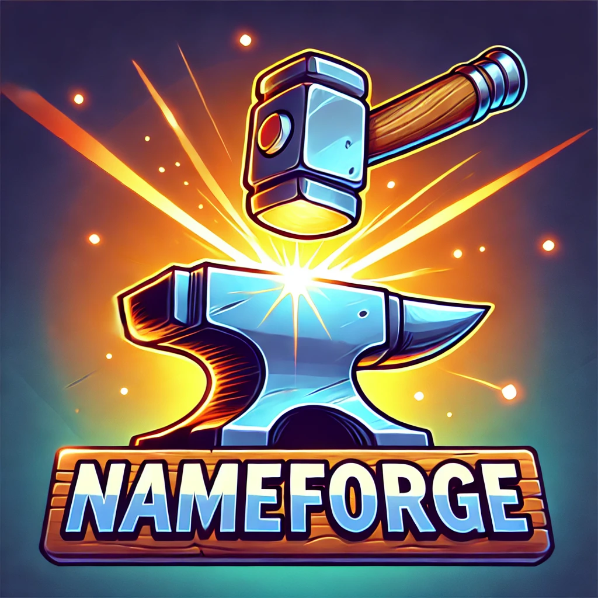

# About
A Go library which can be used for name generating and dynamically extended with your own content. It can be used standalone as a cli tool or as a library in some other code.

Some use cases might include random client name generation and session name generation.

# Usage
```
┏━━━━━━━━━━━━━━━━━━━━━━━━━━━━━━━━━━━━━━━━━━━━━━━━━━━━━━━━━━━━┓
┃                                                            ┃
┃                  🧰 Welcome to NameForge 🔨                ┃
┃                                                            ┃
┃        Your everyday tool for producing random names       ┃
┃                                                            ┃
┃   -h --help   Displays this help message                   ┃
┃                                                            ┃
┃   -s          The format used for forging your sentence    ┃
┃               containing a comma separated list of tags    ┃
┃               N,ADJ,V,ADV,NAME                             ┃
┃                                                            ┃
┃   -lu         Displays the available universes             ┃
┃                                                            ┃
┃   -u          Sets the universe to be used                 ┃
┃                   default: STARWARS                        ┃
┃                                                            ┃
┃   -ll         Displays the available languages             ┃
┃                                                            ┃
┃   -l          Sets the language to be used                 ┃
┃                   default: EN                              ┃
┃                                                            ┃
┃   -la         List all available of everything             ┃
┃                                                            ┃
┃   -split      String used for splitting words              ┃
┃               and names which are then rejoined with join  ┃
┃                                                            ┃
┃   -join       String used for joining all split words      ┃
┃               together                                     ┃
┃                                                            ┃
┃   -n          Number of names to be generated              ┃
┗━━━━━━━━━━━━━━━━━━━━━━━━━━━━━━━━━━━━━━━━━━━━━━━━━━━━━━━━━━━━┛
```
